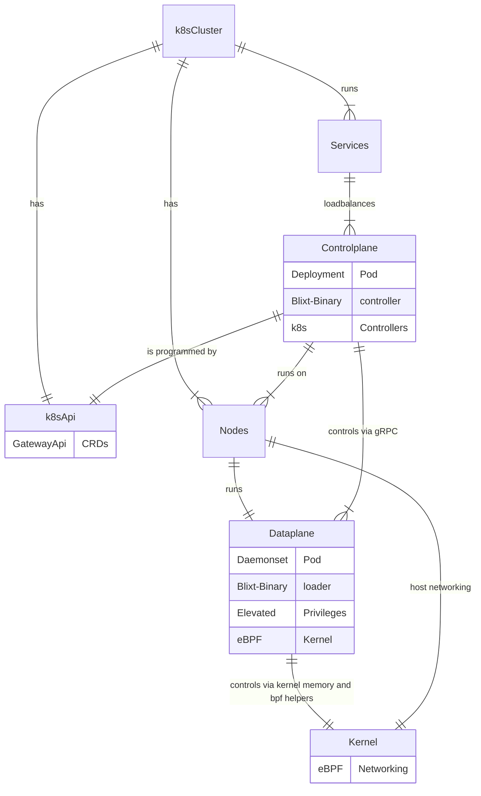
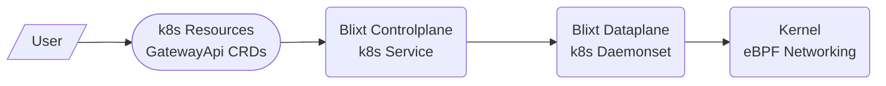

# Design Overview

```mermaid
erDiagram
    k8sApi {
        GatewayApi CRDs
    }
    k8sCluster one to one k8sApi : has
    k8sCluster one to one or many Nodes : "has"
    k8sCluster one to one or many Services : "runs"
    Nodes one to one Dataplane : "runs"

    Services one to one or many Controlplane : "loadbalances"
    Controlplane one to one or many Nodes : "runs on"

    Dataplane {
        Daemonset Pod
        Blixt-Binary loader
        Elevated Privileges
        eBPF Kernel
    }
    Kernel {
        eBPF Networking
    }

    Dataplane one to one Kernel : "controls via kernel memory and bpf helpers"

    Controlplane {
        Deployment Pod
        Blixt-Binary controller
        k8s Controllers
    }

    Controlplane one to one or many Dataplane : "controls via gRPC"
    Controlplane one to one k8sApi : "is programmed by"

    Kernel one to one Nodes : "host networking"
```

# GatewayApi Config Flow

```mermaid
flowchart LR
    User[/User/]
    k8sResources(["k8s Resources
    GatewayApi CRDs"])
    Controlplane("Blixt Controlplane
    k8s Service")
    Dataplane("Blixt Dataplane
    k8s Daemonset")
    Kernel("Kernel
    eBPF Networking")

    User --> k8sResources --> Controlplane ---> Dataplane --> Kernel
```